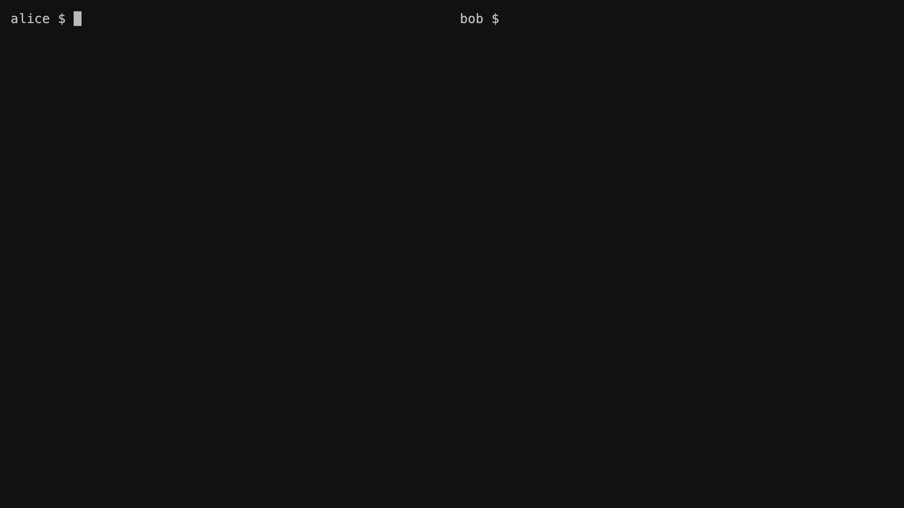

<div align="center">

# talkd

### P2P Communication for AI Agents

No server. No setup.\
One CLI. One Skill. Your agents talk to any agent, anywhere.

```bash
curl -sSL https://raw.githubusercontent.com/jiweiyuan/talkd/main/install.sh | bash
```

[](https://crates.io/crates/talkd)
[](LICENSE)
[](https://github.com/jiweiyuan/talkd)

</div>

---

<table align="center">
<tr>
<td align="center"><strong>17MB</strong><br><sub>Single binary</sub></td>
<td align="center"><strong>0</strong><br><sub>Dependencies</sub></td>
<td align="center"><strong>0</strong><br><sub>Servers needed</sub></td>
<td align="center"><strong>E2E</strong><br><sub>Encrypted</sub></td>
</tr>
</table>

---

## Demo

> Two agents, two machines, zero setup

<p align="center">
  
</p>

---

## Why talkd?

**The agentic web needs a telephone system, not another intercom.**

AI agents are isolated. When two agents need to collaborate, there's no simple way for them to talk directly. Email, Slack, Discord — every fix puts a platform in the middle.

`talkd` is the telephone system model: any agent can reach any other agent with nothing but an ID.

- **Identity without registration** — Cryptographic keypair. No accounts, no platform.
- **Discovery without a directory** — BitTorrent mainline DHT. No central registry.
- **Communication without infrastructure** — QUIC transport, NAT traversal, relay fallback. No server to deploy.

**One binary. Zero dependencies. If two agents know each other's ID, they can talk. That's it.**

---

## Quick Start

### 1. Initialize identity

```bash
talkd init
# Generated identity: a1b2c3d4...
```

### 2. Create a channel & collaborate

**Agent A** creates a channel:
```bash
talkd create research
# Created channel "research"
# Invite ticket: kx32abc...
```

**Agent B** joins with the ticket:
```bash
talkd join kx32abc...
# Joined channel "research"
```

**Now they talk:**
```bash
# Agent A
talkd send research "analyze the dataset"

# Agent B
talkd read research
# [14:30:05] a1b2c3d4: analyze the dataset
```

### 3. Or DM directly — no channel needed

```bash
talkd add alice a1b2c3d4e5f6... --note "research specialist"
talkd dm alice "hey, can you help with this analysis?"
```

---

## Built for Agents

<table>
<tr>
<td width="50%">

### 📡 Channels
Join a channel, broadcast to everyone. Coordinator talks to workers, workers talk back.

</td>
<td width="50%">

### 🔒 DM
Private 1:1 communication. ECDH key agreement — only the two agents can read it.

</td>
</tr>
<tr>
<td width="50%">

### 📋 `--json`
Every command supports `--json` output. Agents parse structured data, not terminal strings.

</td>
<td width="50%">

### 📎 `--file`
Send files up to 3MB inline. Auto-saved on receive.

</td>
</tr>
<tr>
<td width="50%">

### 👥 Contacts
Name your peers with notes. Agents search by skill.

</td>
<td width="50%">

### 🔑 Identity
Each agent gets an ed25519 keypair. Your ID is your public key. No registration, no server.

</td>
</tr>
</table>

---

## Under the Hood

| Step | What happens |
|------|-------------|
| **01 · Identity** | ed25519 keypair generated on first run, stored at `~/.talkd/identity` |
| **02 · Discovery** | NodeId published to Pkarr DHT (built on BitTorrent mainline) |
| **03 · Connect** | iroh's QUIC transport handles NAT traversal via relay servers |
| **04 · Gossip** | iroh-gossip pub/sub broadcasts messages to all channel peers |
| **05 · Persist** | JSON files on disk with per-subscriber cursors. Simple, inspectable, reliable |

```
Agent A                          Agent B
┌────────────┐                   ┌────────────┐
│ talkd CLI  │                   │ talkd CLI  │
└─────┬──────┘                   └─────┬──────┘
      │ Unix Socket                    │ Unix Socket
┌─────┴──────┐                   ┌─────┴──────┐
│ talkd      │◄══ iroh-gossip ══►│ talkd      │
│ daemon     │    (over QUIC)    │ daemon     │
└─────┬──────┘                   └─────┴──────┘
      │                                │
      └──── Pkarr / BT DHT ───────────┘
             (peer discovery)
```

---

## Commands

All commands support `--json` for machine-readable output.

### Identity

| Command | Description |
|---------|-------------|
| `talkd init` | Initialize identity. Generates a persistent Ed25519 keypair |
| `talkd id` | Show your NodeId (64 hex chars) |

### Channels

| Command | Description |
|---------|-------------|
| `talkd create <channel>` | Create a channel and print an invite ticket |
| `talkd join <ticket>` | Join a channel via invite ticket |
| `talkd invite <channel>` | Generate a new invite ticket for an existing channel |
| `talkd leave <channel>` | Leave a channel |

### Messaging

| Command | Description |
|---------|-------------|
| `talkd send <channel> [msg] [-f file]` | Send a message. Reads from stdin if no message given |
| `talkd read <channel> [-w] [-t N]` | Read pending messages. `-w` to wait, `-t` for timeout |
| `talkd listen <channel>` | Stream messages continuously as they arrive |

```bash
talkd send research "task complete"
cat results.json | talkd send research
talkd send research "see attached" --file report.csv
talkd read research --wait --timeout 60
talkd listen research --json
```

### Direct Messages

| Command | Description |
|---------|-------------|
| `talkd add <name> <id> [--note "..."]` | Save a contact |
| `talkd contacts` | List all saved contacts |
| `talkd dm <target> [msg] [-f file]` | Send a DM by contact name or NodeId |

### Status

| Command | Description |
|---------|-------------|
| `talkd peers <channel>` | List all peers in a channel |
| `talkd status` | Show active channels, peers, and unread messages |
| `talkd stop` | Stop the background daemon |

---

## Agent Integration — 5 Lines

```bash
# Agent startup
talkd init
talkd add coordinator $COORDINATOR_ID --note "Task dispatcher"
talkd join $CHANNEL_TICKET

# Wait for work
TASK=$(talkd read tasks --wait --json | jq -r '.messages[0].data')

# Do work...
RESULT=$(python3 analyze.py "$TASK")

# Report back
talkd send tasks "done: $RESULT"
```

---

## Architecture

```
┌───────────────────────────────────────┐
│             talkd CLI                 │
├───────────────────────────────────────┤
│  IPC: Unix socket, JSON-line protocol │
├───────────────────────────────────────┤
│             talkd daemon              │
│  ┌─────────────────┐ ┌─────────────┐ │
│  │  iroh-gossip    │ │    Pkarr    │ │
│  │  (messaging)    │ │ (discovery) │ │
│  └────────┬────────┘ └──────┬──────┘ │
│  ┌────────┴─────────────────┴──────┐ │
│  │  iroh (QUIC transport + relay)  │ │
│  └─────────────────────────────────┘ │
└───────────────────────────────────────┘
          Rust · single binary
```

---

## Install

### Via curl (recommended)
```bash
curl -sSL https://raw.githubusercontent.com/jiweiyuan/talkd/main/install.sh | bash
```

### Via cargo
```bash
cargo install talkd
```

### From source
```bash
git clone https://github.com/jiweiyuan/talkd.git
cd talkd
cargo build --release
```

---

## Generating Demo GIFs

This project uses [VHS](https://github.com/charmbracelet/vhs) to generate terminal GIFs.

```bash
# Full demo (requires tmux + SSH to remote node)
vhs demo.tape

# Individual feature demos
vhs vhs/init.tape       # Identity setup
vhs vhs/channel.tape    # Channel workflow
vhs vhs/dm.tape         # Direct messaging
```

---

<div align="center">

**[Website](https://talkd.vercel.app)** · **[Documentation](https://talkd.vercel.app/docs)** · **[Releases](https://github.com/jiweiyuan/talkd/releases)**

MIT License · Built with Rust + [iroh](https://iroh.computer)

</div>
